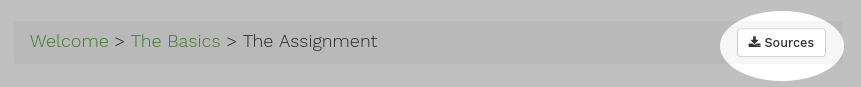

# Welcome
This guide will lead you step by step through the process of packaging, deploying, monitoring and operating a stae of the art web application in a cloud environment. Each step comes with a complete runnable sample so you can see the code evolve through the different stages. Depending on your interest or prior knowledge you should be able to either follow this guide step by step or directly dive into a topic of your interest.

## Prerequisites

In order to reproduce the examples in this guide you will need the following tools available on your machine.

- Git for checking out the example source code
- Terraform to provision the needed infrastructure 
- A Java SDK is needed to compile the application

All tools should be available by your package manager in case of Linux or by [brew](https://brew.sh/) if you work on a Mac. In case something is missing have a look at the following links for installation instructions:

- [Install Git](https://www.terraform.io/intro/getting-started/install.html)
- [Install Terraform](https://git-scm.com/book/en/v2/Getting-Started-Installing-Git)
- [Install Java JDK 8](https://docs.oracle.com/javase/8/docs/technotes/guides/install/install_overview.html)


## Conventions

### Source code
If source code is available for a specific topic a link inside the breadcrumb panel on the top of the page will directly link to it.  




### Snippets
The source code for each step is available at [https://github.com/pellepelster/learn-artefacts](https://github.com/pellepelster/learn-artefacts). On the top of each source code snippet a link points directly to the source file containing the snippet.

{}snippet{}

class ExampleClass {

}


### Shell commands
Lines beginning with a `$` sign are commands that can be executed, where the base directory for each command is always the source directory for the current topic.

```
$ this is a shell command

This is the commands output
```

## Topics
{}
